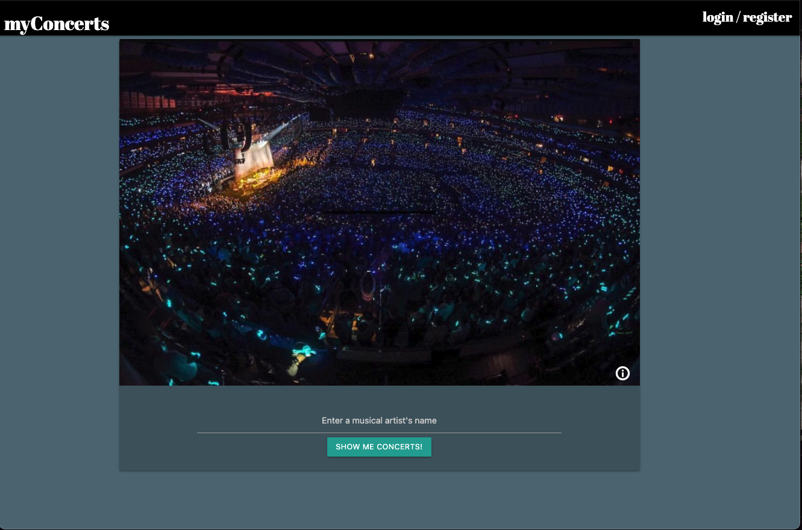
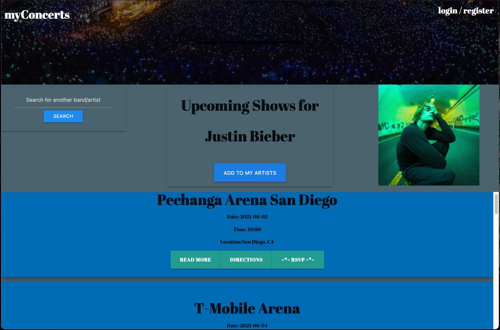
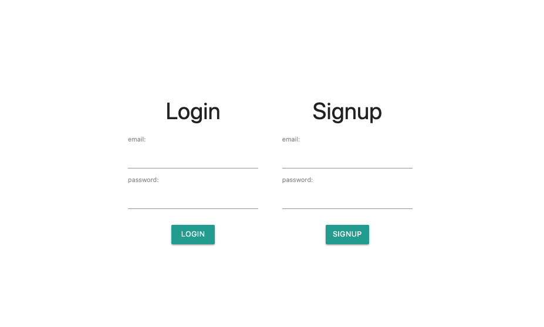
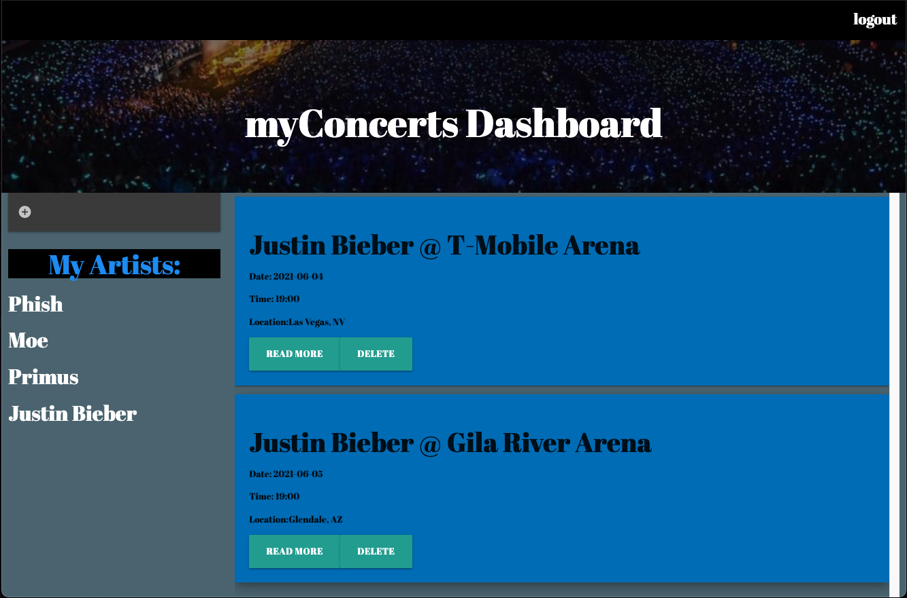

# myConcertsApp

## Purpose

myConcerts is a program designed with the music lover in mind
and heart. Using API calls and database storage, we provide the
user with the ability to search for upcoming events using the
artist's name.

Sign-up with an account today to be able to store your
favorite artists for easy future reference as well as RSVP to
events you wish to attend. The saved information will appear
on your user dashboard when you sign in again!

## How it works
Upon entry to the application, users will be prompted to search for an artist whom they are interested in
seeing live in concert. Search results will be displayed on the next page. This page will also offer links on each event card to give them directions to the venue as well as get "more information" on the event itself via BandsInTown. Users can RSVP to the event which will store the event into a database for future reference. 

Users can log in/sign up (not functional yet) to view their own dashboard of saved events. On the dashboard, they will have the ability to enter favorite artists which will save and display on page as well. Here, they can also delete any events they RSVP'd to in the event they can no longer attend.

### Homepage

### Search Results

### Login / Signup Page

### User Dashboard

## Live Link
[Heroku Deployed Link](https://myconcerts-grp5.herokuapp.com/home.html)